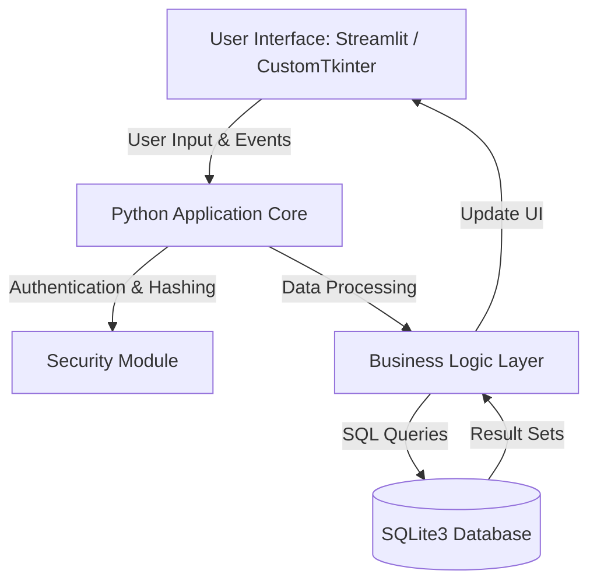
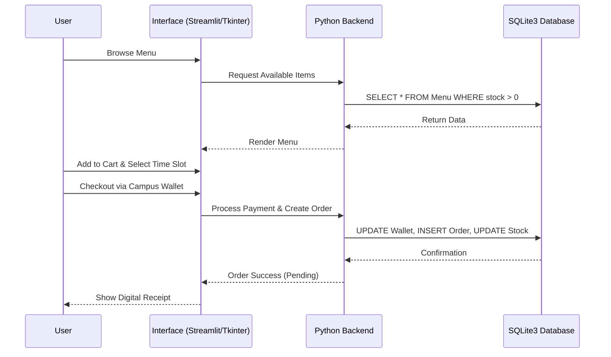

# 1. Project Title
**Smart Campus Canteen Order System**

# 2. Introduction
The Smart Campus Canteen Order System is a modern, comprehensive digital platform designed to optimize the food ordering process within university campuses. By transitioning from traditional manual ordering and cash-based payments to a streamlined digital experience, this system significantly reduces wait times and eliminates long queues. Students and faculty can pre-order meals, select convenient pickup times, and securely pay using an integrated Campus Wallet. Designed with a robust Python-based architecture, the platform also empowers kitchen staff and canteen administrators with real-time order tracking and dynamic inventory management, ultimately fostering a smarter, more efficient campus ecosystem.

# 3. Problem Statement
Campus canteens frequently experience massive congestion during peak hours (e.g., lunch breaks), leading to long waiting queues, wasted time for students and staff, and heightened stress for kitchen personnel. Traditional cash transactions and manual order-taking further slow down the process and increase the likelihood of errors. Furthermore, the lack of real-time inventory tracking often results in food wastage or unfulfilled orders, causing dissatisfaction among canteen patrons.

# 4. Objective
- **Eliminate Queues:** Enable users to pre-order food and pick it up at scheduled time slots.
- **Cashless Transactions:** Integrate a secure Campus Wallet for seamless, quick payments.
- **Improve Kitchen Efficiency:** Provide real-time dashboards for kitchen staff to track and manage order statuses efficiently.
- **Dynamic Inventory Management:** Allow administrators to update the menu and monitor stock levels in real time to prevent overselling.
- **Enhance User Experience:** Deliver a fast, responsive, and intuitive UI using modern Python GUI/Web technologies.

# 5. Project Description
The Smart Campus Canteen Order System is a lightweight, efficient application designed for three primary user roles: Customers (Students & Faculty), Kitchen Staff, and Administrators. 
Built on a robust Python ecosystem—utilizing Streamlit (or CustomTkinter) for an interactive and accessible interface, and SQLite3 as a reliable, file-based relational database—the system ensures high performance, easy deployment, and low resource consumption. 
Customers can browse dynamic, time-based menus, place pre-orders, and pay via an internal digital wallet. Kitchen staff receive incoming orders in a structured dashboard to prepare meals, while administrators maintain comprehensive control over the menu, pricing, inventory, and analytics.

# 6. Functional Features
1. **User Authentication & Authorization:** Secure Login & Registration with role-based access control (Student, Faculty, Kitchen Staff, Admin) utilizing password hashing.
2. **Dynamic Menu Management:** Time-based menu categorization (Breakfast, Lunch, Dinner) with real-time stock availability updates.
3. **Pre-Order & Time Slot Booking:** Customers can pre-order items and select from available pickup time slots; fully booked slots are automatically disabled.
4. **Campus Wallet Payment:** Cashless payment integration with an internal wallet, featuring automatic balance deduction and transaction history logs.
5. **Kitchen Order Management:** Real-time incoming order tracking with status updates (Pending → Preparing → Ready for Pickup).
6. **Admin Dashboard:** Centralized control to add/edit/delete menu items, manage prices and inventory, and view sales reports.
7. **Feedback & Rating System:** Post-order feedback functionality for customers to rate meals, allowing admins to monitor service quality.

# 7. Non-Functional Features
1. **Usability:** A highly intuitive interface built with Streamlit/CustomTkinter, ensuring minimal clicks for order placement and an easy learning curve.
2. **Performance:** Quick system response times using Python backend logic and local SQLite3 database optimizations.
3. **Security:** Secure user sessions, password encryption (e.g., using bcrypt), and protected database operations using parameterized queries to prevent SQL injection.
4. **Reliability & Scalability:** Lightweight architecture that handles concurrent local transactions smoothly, without crashing.
5. **Data Integrity:** ACID-compliant transactional logic via SQLite3 for wallet deductions and inventory updates to prevent duplicate bookings or overselling.

# 8. System Specifications & Architecture
**Technology Stack:**
- **Programming Language:** Python 3.x
- **Frontend / UI:** Streamlit (for Web) or CustomTkinter (for Desktop)
- **Database:** SQLite3
- **Authentication / Security:** Python hashlib / bcrypt
- **Data Manipulation:** Pandas (for admin reporting and dashboard analytics)
- **Version Control & Collaboration:** Git, GitHub

# 9. Diagrams

### System Architecture

### User Flow (Customer Order Process)

# 10. Project Uniqueness
- **Integrated Campus Wallet:** Unlike standard e-commerce apps that rely entirely on third-party payment gateways, the built-in campus wallet ensures zero-fee, instant transactions tailored specifically for university ecosystems.
- **Time-Slot Capacity Management:** The system prevents kitchen overload by capping the number of orders per specific time slot.
- **Lightweight & Portable:** By using Python and SQLite3, the entire system can be deployed and run locally or on a standard campus server with virtually zero initial infrastructure costs.

# 11. Expected Outcome & Future Scope
**Expected Outcome:**
A fully functional, deployable desktop or web application that seamlessly handles the end-to-end ordering process for a campus canteen. It will drastically reduce queue times, eliminate cash handling errors, and provide a dashboard for data-driven management.

**Future Scope:**
- Migration to a cloud-based relational database (e.g., PostgreSQL or MySQL) for multi-campus scaling.
- Mobile application development for native iOS/Android experiences.
- AI-based food recommendation engine based on user order history using Python ML libraries (Scikit-learn).
- Email or SMS notifications via Python SMTP / Twilio for instant status alerts.

# 12. Member Contribution & Weekly Timeline
**Team Setup (4 Members):**
- **Member 1 (Project Manager & Lead UI):** System design, Streamlit/CustomTkinter UI/UX implementation, routing.
- **Member 2 (Backend & Database Architect):** SQLite3 schema design, database connection logic, CRUD functions.
- **Member 3 (Security & Logic Specialist):** Password hashing, session management, wallet transaction logic, time-slot logic.
- **Member 4 (QA & Integration Engineer):** Testing, data reporting (Pandas integration), bug fixing, documentation.

**Weekly Timeline (8 Weeks):**
- **Week 1:** Requirement analysis, UI wireframing, GitHub repository setup, and environment configuration.
- **Week 2:** Database schema design (SQLite3 tables) and user authentication logic setup.
- **Week 3:** Frontend UI development (Login, Menu browsing, Dashboard layouts) using Python.
- **Week 4:** Core backend development (Order management, Time-slot capacity control).
- **Week 5:** Campus Wallet integration, transaction processing, and cart state management.
- **Week 6:** Kitchen and Admin dashboard functionalities, data visualization with Pandas.
- **Week 7:** Comprehensive testing (Unit, Integration, and QA), bug fixing, and UI polishing.
- **Week 8:** Final packaging (e.g., using PyInstaller or Streamlit Cloud deployment), documentation completion, and project presentation preparation.

# 13. Conclusion
The Smart Campus Canteen Order System represents a necessary digital transformation for university dining facilities. By leveraging a highly efficient and accessible Python tech stack (Streamlit/CustomTkinter, SQLite3), this project will deliver a scalable, robust, and user-centric application. Through the collaborative efforts of our software engineering team, this platform will solve real-world logistical challenges on campus, ultimately proving to be an invaluable asset to both the administration and the student body.
